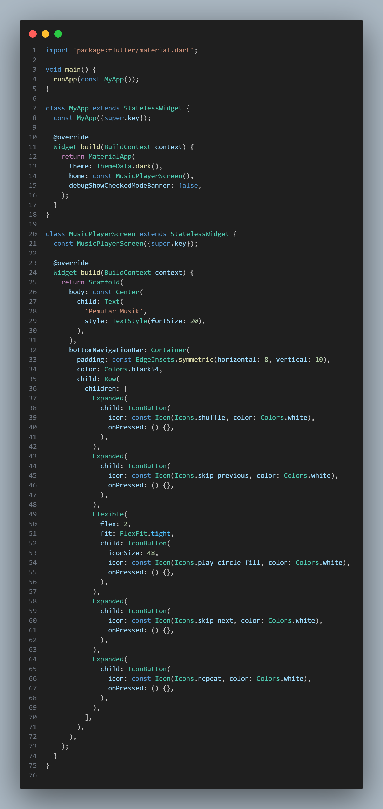
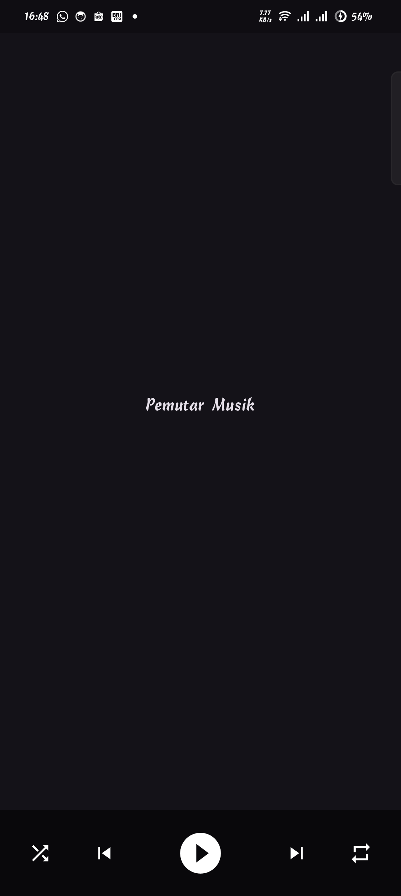

📑 Laporan Praktikum

Pertemuan 4 – 	Widget Flexible dan Expanded

Judul Tugas : Laporan Praktikum Mobile Programming – Control Bar Pemutar Musik dengan Expanded dan Flexible
Nama : [Isi Nama Kamu]
NIM : [Isi NIM Kamu]
Kelas : [Isi Kelas Kamu]
Tanggal Pengumpulan : [Isi Tanggal]

Tujuan

Memahami penggunaan widget Row, Expanded, dan Flexible dalam Flutter.
Mempelajari cara mendistribusikan ruang secara proporsional antar tombol kontrol musik.
Mengetahui perbedaan efek penggunaan Flexible (flex & fit) dan Expanded pada tata letak UI.

Langkah Kerja Singkat

Membuat proyek Flutter baru dengan tema ThemeData.dark() agar latar belakang aplikasi terlihat gelap.
Menambahkan Scaffold dengan properti bottomNavigationBar untuk meletakkan control bar di bagian bawah layar.
Membungkus control bar dengan Container yang diberi padding EdgeInsets.symmetric(horizontal: 8, vertical: 10) dan warna latar Colors.black54.
Menambahkan Row berisi lima tombol ikon:

Shuffle (Icons.shuffle)

Previous (Icons.skip_previous)
Play (Icons.play_circle_fill)
Next (Icons.skip_next)
Repeat (Icons.repeat)

Mengatur empat tombol (Shuffle, Previous, Next, Repeat) menggunakan Expanded agar memiliki ukuran rata.
Mengatur tombol Play menggunakan Flexible(flex: 2, fit: FlexFit.tight) supaya tampil lebih besar.
Memberikan warna ikon putih dan memperbesar ikon Play agar menonjol di tengah.
Menjalankan aplikasi di emulator/HP untuk melihat hasil tampilan control bar.

Cuplikan Kode 

Screenshot

Tombol Play terlihat lebih besar dibanding tombol lainnya.

Kesimpulan

Expanded digunakan untuk membagi ruang secara rata antar tombol kontrol musik (Shuffle, Previous, Next, Repeat).
Flexible dengan flex: 2 membuat tombol Play lebih besar dan menonjol di tengah.
Kombinasi Row, Expanded, dan Flexible memudahkan pengaturan tata letak UI yang proporsional dan responsif.
Konsep ini dapat diaplikasikan untuk membuat UI control bar pada aplikasi musik nyata.